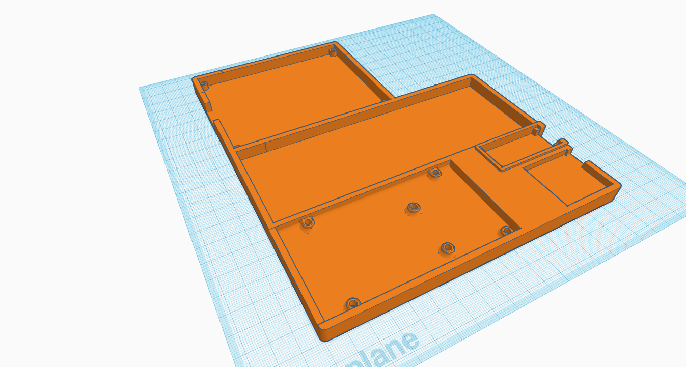

# [things](https://www.thingiverse.com/dotwee)

_collection of random 3d things*, objects and files**_

* most of them are published on my thingiverse profile [@dotwee](https://www.thingiverse.com/dotwee)
 
** mostly made to function and with **no sense of aesthetics** in mind!

## [designs](https://www.thingiverse.com/dotwee/designs)

| Name | Draft | Image | Sources | Links |
|------|--------|--------|---------|-------|
| **Holder for Arduino Uno/Mega/Nano + Breadboard + 4.2 Inch E-Paper Display Modul** |  |  | [./Holder_Arduino-Breadboard-Display/](./Holder_Arduino-Breadboard-Display/README.md) | [Thingiverse](https://www.thingiverse.com/thing:3826259) |

## [license](./LICENSE)

    copyright (c) 2019 lukas 'dotwee' wolfsteiner <lukas@wolfsteiner.media>

 

    source code released under the do what the fuck you want to public license
