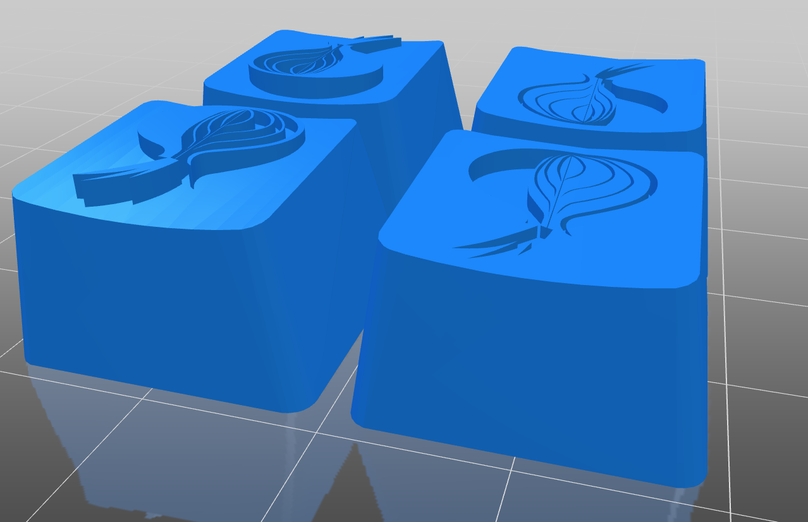
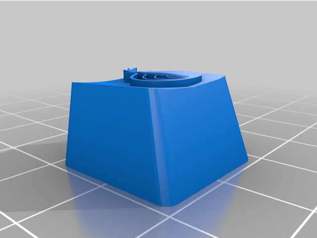
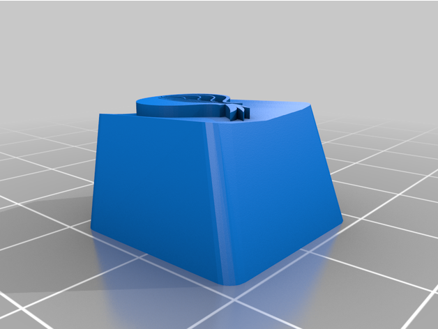
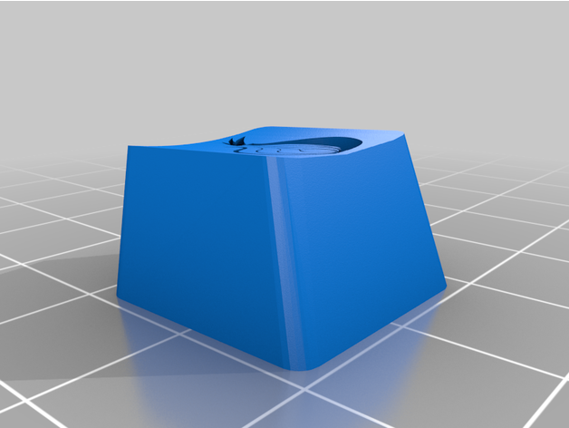
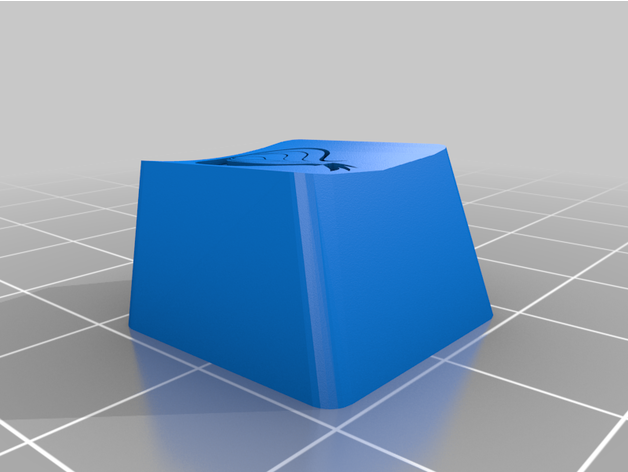

# [The Tor Project (torproject.org) Cherry MX Keycap](https://www.thingiverse.com/thing:4352680)

> This thing was made with Tinkercad. Edit it online: https://www.tinkercad.com/things/4Cli95f0Qs1-the-tor-project-torprojectorg-cherry-mx-keycap/edit

## Summary

Based on this icon: https://www.iconfinder.com/icons/386502/browser_onion_tor_icon

## Resources

| File                                                                                                                      | Image                                                                                                        |
|---------------------------------------------------------------------------------------------------------------------------|--------------------------------------------------------------------------------------------------------------|
| 1. [Tor_Project_Cherry_MX_Keycap-All.stl](./Tor_Project_Cherry_MX_Keycap-All.stl)                                         |                      |
| 2. [Tor_Project_Cherry_MX_Keycap-MaleCutout.stl](./Tor_Project_Cherry_MX_Keycap-MaleCutout.stl)                           |               |
| 3. [Tor_Project_Cherry_MX_Keycap-MaleCutout-Upsidedown.stl](./Tor_Project_Cherry_MX_Keycap-MaleCutout-Upsidedown.stl)     |    |
| 4. [Tor_Project_Cherry_MX_Keycap-FemaleCutout.stl](./Tor_Project_Cherry_MX_Keycap-FemaleCutout.stl)                       |             |
| 5. [Tor_Project_Cherry_MX_Keycap-FemaleCutout-Upsidedown.stl](./Tor_Project_Cherry_MX_Keycap-FemaleCutout-Upsidedown.stl) |  |